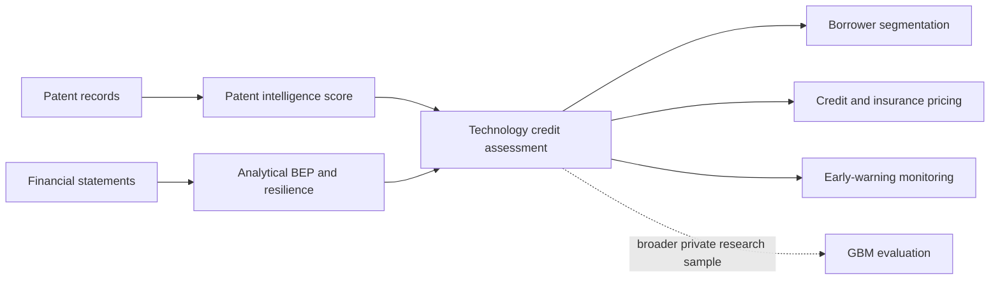

# Kexintong (科信通)

### Patent Intelligence & Financial Resilience Modeling for Technology Credit Assessment

Kexintong is a technology-credit research framework that brings patent evidence and financial resilience into the same assessment process. It is designed to help lenders examine not only what a technology company owns today, but also the quality of its innovation, the durability of its operations, and the way those signals should affect credit terms and monitoring.

The complete study covers a broader private company universe. This repository publishes a five-company reproducibility sample so that the core data flow and deterministic analysis can be inspected without distributing the full research dataset. The public sample demonstrates the method; it is not the definition or full scope of Kexintong.

## Overview

Conventional credit analysis is strongest when value is visible in collateral, stable cash flows, and long operating histories. Technology-oriented companies often look different: important assets sit in patent portfolios, R&D precedes revenue, and short-term statements may understate long-term technical value.

Kexintong addresses that gap through two connected analytical views:

1. **Patent intelligence** measures the scale, quality, technological relevance, growth, and semantic content of a company’s patent portfolio.
2. **Financial resilience** measures cost structure, break-even capacity, sensitivity to operating shocks, and early-warning conditions.

Together, these views support borrower segmentation, differentiated pricing, and post-loan monitoring.

## Analytical Framework



The public workflow follows the solid arrows. Machine-learning evaluation belongs to the broader research workflow and is not retrained on five observations.

## What Kexintong Adds

- **A six-factor patent score.** Patent stock, patent-type quality, IPC heat, recent patent growth, NLP similarity, and frontier-keyword density are combined under one versioned weighting scheme.
- **Technology-aware text analysis.** Company patent text is compared with a frozen high-value patent corpus using TF-IDF and cosine similarity.
- **An operating-resilience measure.** Financial statements are converted to a consistent quarterly basis before cost-structure and break-even analysis.
- **Decision-oriented outputs.** Technology and financial signals are translated into borrower quadrants, pricing adjustments, and warning levels rather than stopping at a descriptive score.
- **An auditable public interface.** CSV schemas, provenance notes, sample-selection metadata, and quality checks are included alongside the code.

## Research and Public Repository Scope

### Complete Research Framework

The underlying study was developed on a private sample of 50 A-share companies across 16 technology-related industries. That environment supports the complete patent, financial, and Gradient Boosting evaluation workflow.

### Public Reproducibility Workflow

This repository uses five representative listed companies to reproduce the deterministic portion of the framework:

- input-schema validation and financial-basis conversion;
- six-factor patent valuation;
- analytical break-even-point analysis;
- operating and raw-material sensitivity analysis;
- borrower portfolio classification;
- risk-based lending and insurance recommendations;
- time-series early-warning views.

Public scores are normalized within the five-company sample. They should therefore be read as workflow outputs, not as full-market ranks or replicas of the private 50-company results.

## Data Available Here

| Public asset | Rows | Role in the workflow |
|---|---:|---|
| Company master | 5 | Company identity and technology-field mapping |
| Quarterly financial observations | 95 | Revenue, cost, expenses, R&D, and operating cash flow |
| Company patent records | 3,911 | Portfolio, legal-status, IPC, type, and text analysis |
| High-value patent reference | 198 | Frozen NLP comparison corpus |
| IPC market reference | 1,593 | Technology-track heat and concentration reference |
| Industry BEP reference | 16 | Industry-level operating benchmarks |
| Raw-material series | 5 years | Scenario and sensitivity reference |

The public package also includes JSON schemas, a quality report, selection metadata, and source-provenance documentation. The private full-sample workbooks are not part of this repository.

Detailed field definitions are available in [`docs/data_dictionary.md`](./docs/data_dictionary.md). Data-source and transformation notes are recorded in [`metadata/source_provenance.md`](./metadata/source_provenance.md).

## Methodology

### Patent Intelligence Score

| Component | Weight |
|---|---:|
| Patent stock | 20% |
| Patent-type quality | 12% |
| IPC technology heat | 20% |
| Recent patent CAGR | 13% |
| NLP semantic similarity | 25% |
| Frontier-keyword density | 10% |

The weighted score is adjusted by a technology-industry multiplier and normalized to a 0–100 scale. The formal configuration is maintained in one scoring configuration source so the report, code, and generated workbook use the same weights.

### Financial-Basis Normalization

Financial flow data is interpreted from the explicit `value_basis` field:

- cumulative year-to-date reports are differenced within each company and fiscal year;
- reported single-quarter values are retained;
- sequence-based inference is only a compatibility fallback when the metadata cannot be used.

### Break-Even and Resilience Analysis

The analytical safety margin is defined as:

```text
BEP revenue       = fixed costs / gross margin
BEP safety margin = observed revenue / BEP revenue
```

Cost behavior is estimated from the company’s quarterly history. The resulting resilience measure feeds the sensitivity, segmentation, pricing, and warning modules.

### Research-Only Model Evaluation

The complete study also evaluates a `GradientBoostingRegressor` using patent-derived and financial-structure features. The reported five-fold cross-validation result is:

```text
R² = 0.667 ± 0.113
```

This is a result of the broader private research sample. It is documented here for research context and is not generated by the five-company public run.

See [`docs/methodology.md`](./docs/methodology.md) for the operational distinction between Demo and Research modes.

## Outputs

The reproducibility workflow is organized around three output groups:

- **Reports:** patent scoring, BEP analysis, and credit recommendations;
- **Figures:** cost structure, patent/financial comparisons, sensitivity, and representative-company profiles;
- **Interactive views:** borrower portfolio positioning and BEP time-series monitoring.

Curated reproducibility outputs belong in `outputs/examples/`. A local run writes fresh results to `outputs/latest/`, which is excluded from version control.

## Repository Layout

```text
kexintong/
├── src/
│   ├── patent_scoring/        # Patent valuation and NLP module
│   └── bep_analysis/          # BEP, sensitivity, segmentation and pricing
├── scripts/                   # Demo preparation and explicit run modes
├── data/
│   ├── demo/                  # Five-company public sample
│   ├── reference/             # Frozen analytical references
│   ├── schema/                # Public data contracts
│   └── generated/             # Local compatibility inputs
├── metadata/                  # Selection, quality and provenance records
├── docs/                      # Methodology and data dictionary
├── outputs/
│   ├── examples/              # Curated public-workflow examples
│   └── latest/                # Local run output; not committed
└── report/
    └── Kexintong_Report.pdf
```

## Run the Public Workflow

```bash
python -m pip install -r requirements.txt
python scripts/run_demo.py
```

The runner prepares internal compatibility files under `data/generated/` and writes current results to `outputs/latest/`.

The private research entry point is separate:

```bash
python scripts/run_research.py --data-dir PATH_TO_PRIVATE_PREPARED_DATA
```

> **Current repository status:** the patent valuation and NLP module is now implemented under `src/patent_scoring/` and integrated with the public workflow. Running `python scripts/run_demo.py` executes patent scoring first, followed by BEP, sensitivity, borrower-segmentation, pricing, and early-warning analysis on the bundled five-company sample.

## Limitations

- Five-company normalization does not reproduce the scale or ranking of the full research universe.
- The public package cannot reproduce private full-sample model training.
- TF-IDF provides an interpretable semantic baseline but does not capture the full contextual capacity of modern embedding models.
- The model result is proof-of-concept evidence from a limited research sample, not production validation.
- Outputs support research and credit analysis; they are not automated approval decisions or investment recommendations.

## Full Report

The research report documents the broader financing mechanism, quantitative validation, methodology, policy discussion, and appendices.

[Read the full Kexintong report](./report/Kexintong_Report.pdf)

## Team

Developed by **Team Oyster Hour**.

- **Xiaoyu (Sophy) Xia** — project framework, data sourcing, financial-resilience analysis, BEP modeling, and credit-decision design.
- **Xiaolei Zhang** — patent intelligence, NLP scoring, code integration, and interactive analytical outputs.
